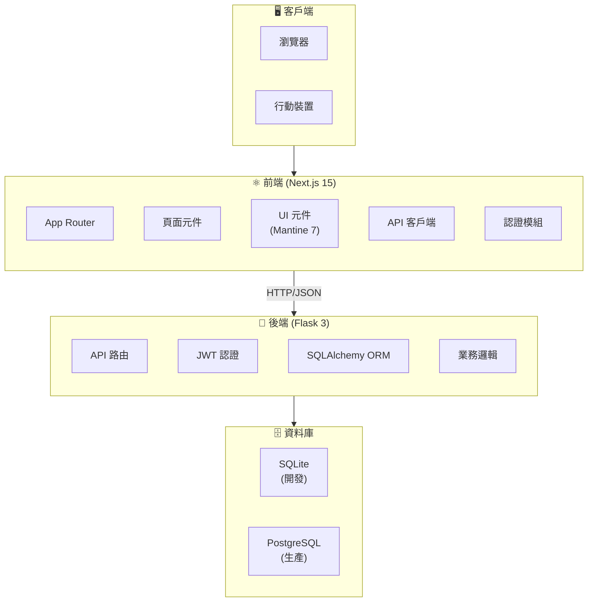
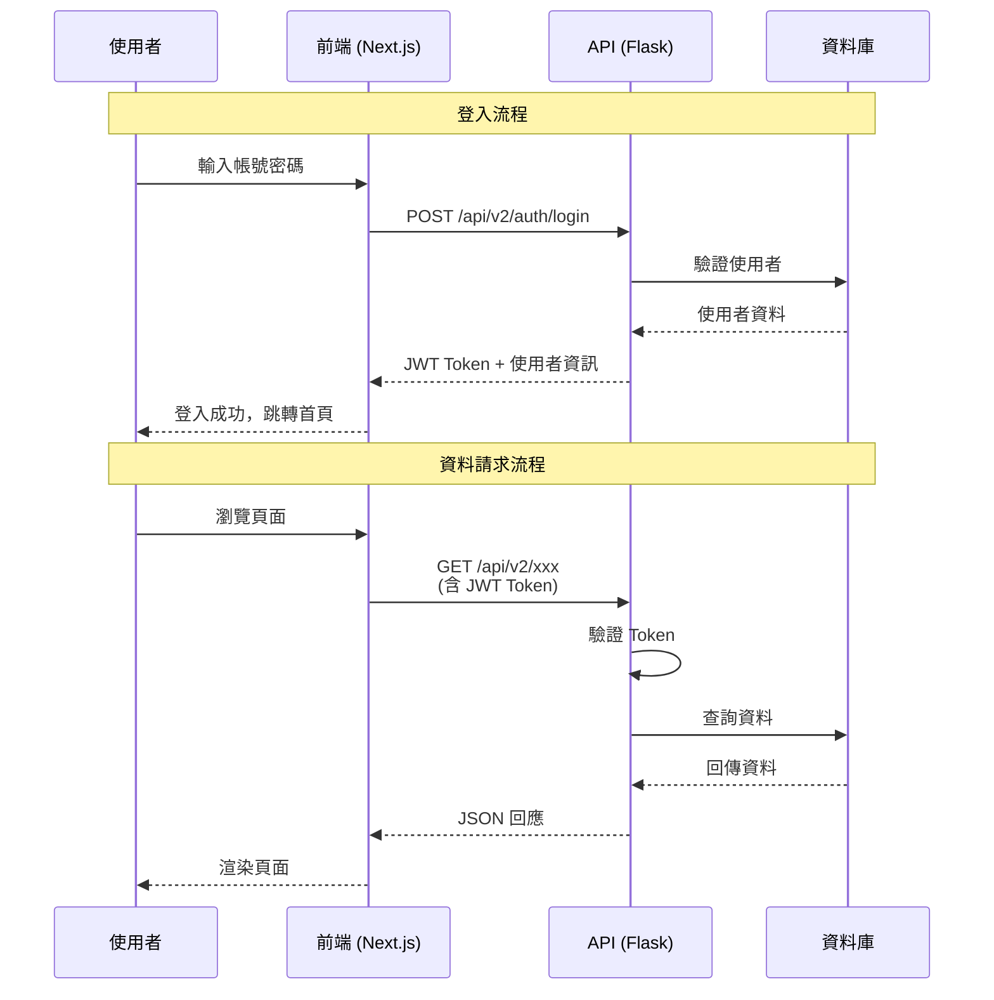
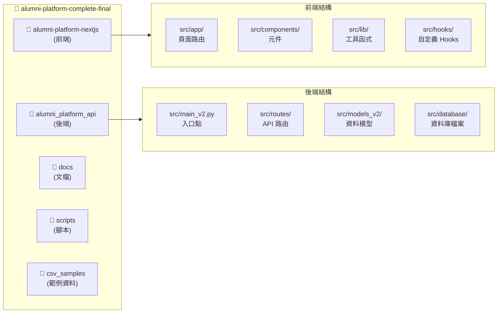
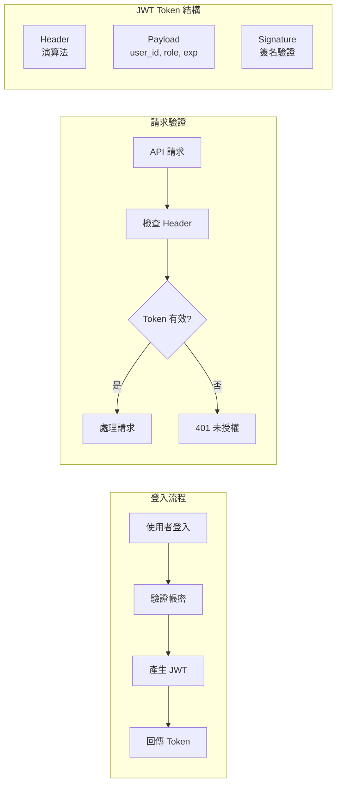
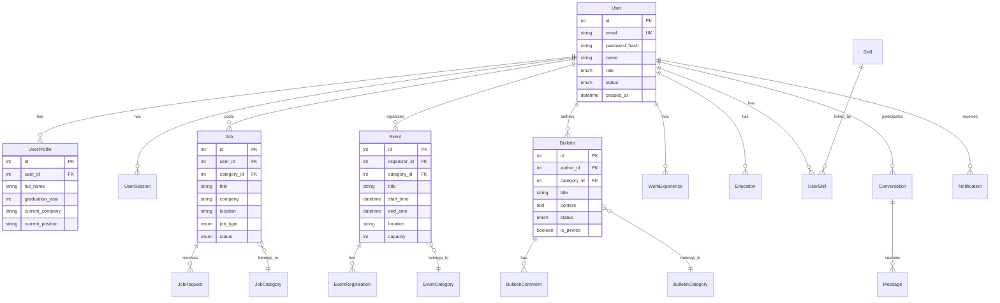
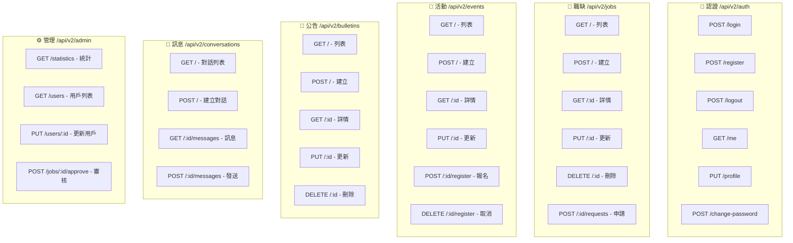
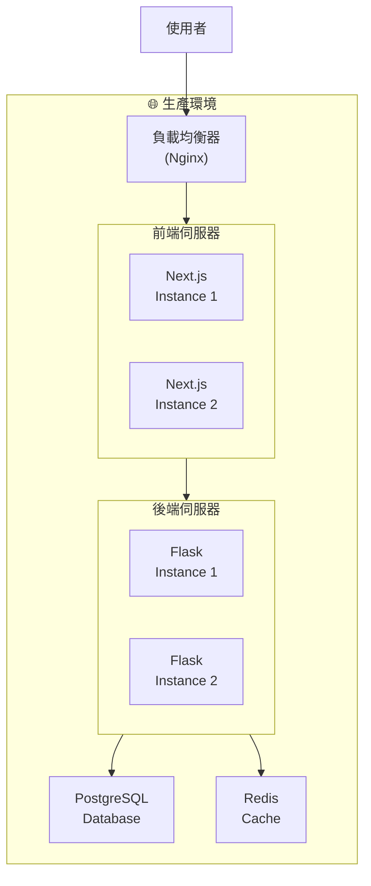
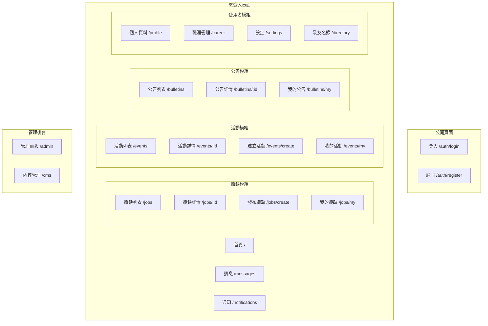
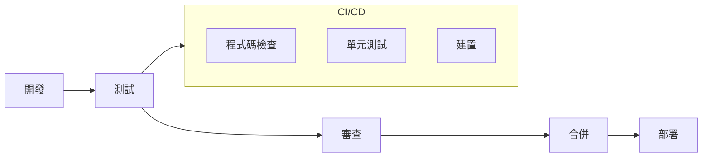

# 🏗️ 校友平台系統架構文檔

> 本文檔詳細說明校友平台的系統架構、技術棧、資料流程與部署架構

---

## 📊 系統架構總覽

---

## 🔄 資料流程圖

---

## 🗂️ 專案目錄結構

---

## 🔐 認證架構

---

## 📦 資料庫模型架構

---

## 🌐 API 端點架構

---

## 🚀 部署架構

---

## 📱 前端頁面結構

---

## 🔧 技術棧詳細說明

### 前端技術棧

| 技術 | 版本 | 用途 |
|------|------|------|
| Next.js | 15.0 | React 框架 (App Router) |
| React | 19 | UI 函式庫 |
| Mantine | 7 | UI 元件庫 |
| TypeScript | 5 | 型別安全 |
| Tailwind CSS | 3 | 樣式框架 |
| TipTap | 2 | 富文本編輯器 |
| Socket.IO Client | 4 | WebSocket 客戶端 |

### 後端技術棧

| 技術 | 版本 | 用途 |
|------|------|------|
| Flask | 3.x | Web 框架 |
| SQLAlchemy | 2.0+ | ORM |
| PyJWT | 2.x | JWT 認證 |
| Flask-CORS | 4.x | 跨域支援 |
| Flask-SocketIO | 5.x | WebSocket |
| Werkzeug | 3.x | 密碼加密 |

### 資料庫

| 環境 | 資料庫 | 說明 |
|------|--------|------|
| 開發 | SQLite | 輕量、無需安裝 |
| 生產 | PostgreSQL | 高效能、可擴展 |

---

## 📝 設計原則

### 前端設計原則

1. **元件化開發** - 可重用的 UI 元件
2. **型別安全** - TypeScript 確保型別正確
3. **響應式設計** - 支援各種螢幕尺寸
4. **漸進式載入** - 優化使用者體驗

### 後端設計原則

1. **RESTful API** - 標準化的 API 設計
2. **模組化架構** - Blueprint 分離功能
3. **安全優先** - JWT 認證、密碼加密
4. **可擴展性** - 支援水平擴展

### 資料庫設計原則

1. **正規化** - 減少資料冗餘
2. **軟刪除** - 保留歷史記錄
3. **時間戳記** - 追蹤資料變更
4. **索引優化** - 提升查詢效能

---

## 🔄 開發流程

---

**文檔版本**: 2.0  
**最後更新**: 2025-11-25

